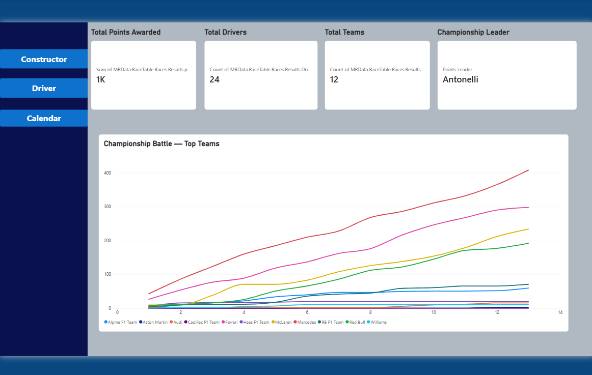
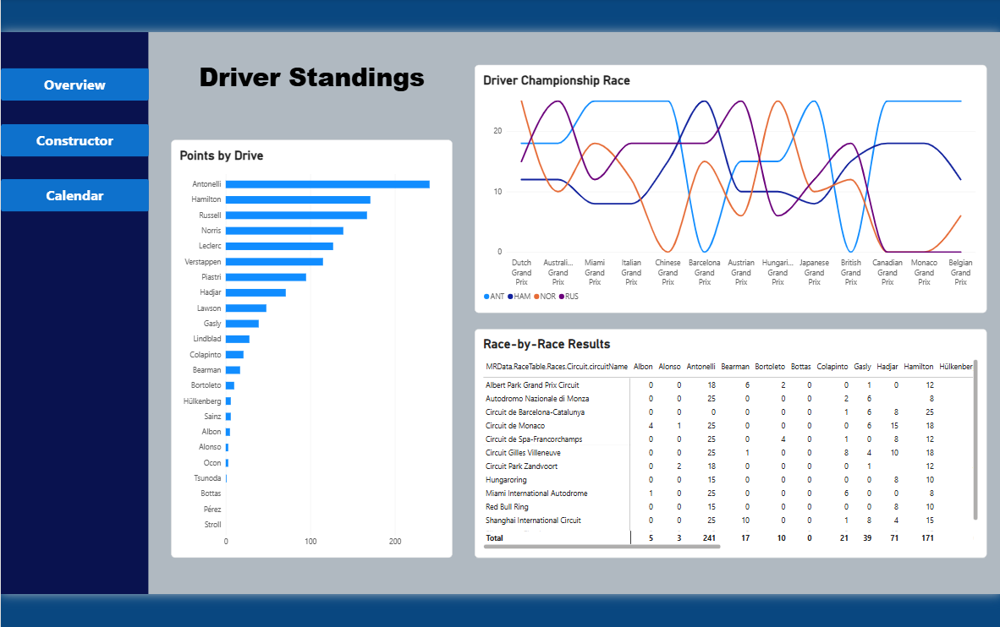

# F1 2026 Season Dashboard

An interactive Power BI dashboard tracking the 2026 Formula 1 season — driver standings, constructor championship battle, race-by-race results, and circuit locations.

## Data Source

Pulled from the [Jolpica-F1 API](http://api.jolpi.ca/ergast/f1/) (the community-maintained successor to the deprecated Ergast API), using paginated requests to retrieve full season results.

## Features

- **4 dashboard pages**: Overview, Drivers, Constructors, Race Calendar
- **KPI cards** on the Overview page: total points awarded, total drivers, total teams, current championship leader
- **Cumulative points tracking** (running totals) for both the driver and constructor championships, filtered to the top performers for readability
- **Race-by-race results table** with chronological sorting
- **Interactive slicer** to filter the dashboard by race
- **Circuit map** showing race locations by latitude/longitude
- **Race calendar** with completed/upcoming status per race

## Screenshots

## Technical Notes

- **API pagination**: Jolpica-F1 caps each request at 100 rows regardless of the requested limit. Solved by combining 6 offset-based queries (`offset=0,100,200,300,400,500`) and appending them into a single table, covering a full season's worth of results (~530 rows max).
- **JSON flattening**: used Power Query to expand and flatten deeply nested JSON (race → results → driver/constructor/lap data) into a clean relational table.
- **DAX measures**: built a dynamic measure to surface the current points leader as a live KPI card.
- **Data currency**: the dashboard reflects whatever data Jolpica-F1 has published at the time of refresh. Community-run APIs like this can lag official race results by up to 24–48 hours after a race weekend.
- **Refresh**: designed to support Power BI Service scheduled auto-refresh; currently refreshed manually in Power BI Desktop due to a regional account verification issue with Power BI Service sign-up. The pagination architecture is already refresh-ready once that's resolved.

## Built With

- Power BI Desktop
- Power Query (M)
- DAX
- Jolpica-F1 REST API
